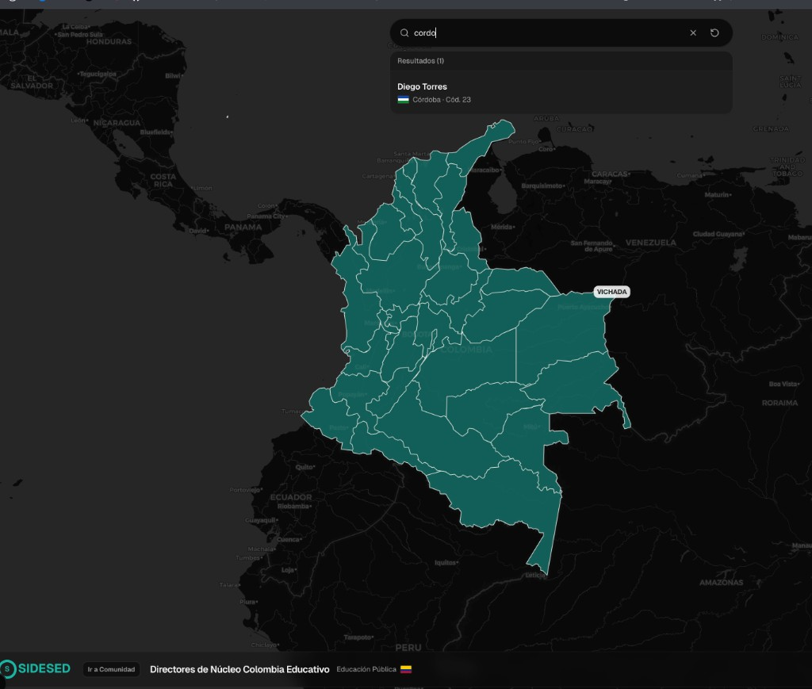

# maps-coordinadores-nucleo-colombia



Interactive map of Colombia to look up education coordinators by department, with:

- Search by name and department
- Dynamic highlighting on the map
- Contextual popover on the selected department
- Light / dark / system theme
- Links to the SIDESED community

## Stack

- Next.js 16 (App Router)
- React 19 + TypeScript
- Tailwind CSS + shadcn/ui
- Leaflet + react-leaflet
- pnpm

## Local development

```bash
pnpm install
pnpm dev
```

Open [http://localhost:3000](http://localhost:3000).

## Scripts

```bash
pnpm dev
pnpm lint
pnpm build
pnpm start
```

## Geographic data

Department geometry source: [caticoa3/colombia_mapa](https://github.com/caticoa3/colombia_mapa).
